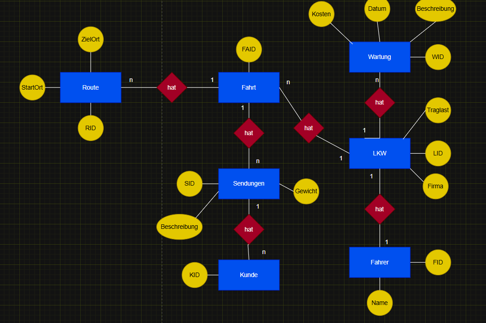
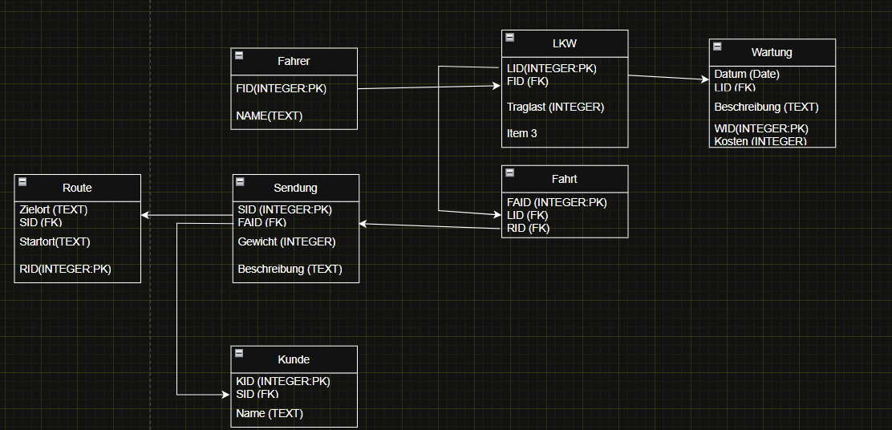

# Projektbeschreibung:

In diesem Projekt werden Statistiken angezeigt, bei welchen dargestelltw erden, wann, von wo bis wo und von wem Produkte geliefert wurden.
Die Kosten für die Wartung kann im Unterfenster für mehr Details nach der Firmen gefiltert werden.
Wenn man schon Filterung erwähnt kann man auch im Hauptmenü nach den Firmen die am Anfang genannten Daten nach den Firmen filtern.
Im Unterfenster kann man zusätzlich noch im Histogramm die Kostenverteilung pro Firma anzeigen lassen. (Es geht auch für alle Firmen insgesamt)

## Prompt von Gemini zur Orientierung zum ERM bzw. RM:
Das System verwaltet die Planung von Transporten. Ein zentrales Element ist die Fahrt, welche Ressourcen (LKW, Fahrer) und Strecken (Routen) kombiniert. Jede Fahrt kann mehrere Sendungen aufnehmen. Dies ermöglicht eine detaillierte Nachverfolgung, welche Frachtstücke sich in welchem Fahrzeug befinden. Zusätzlich wird die Wartung der Flotte überwacht, um Ausfälle zu minimieren.

## ERM 

## RM
